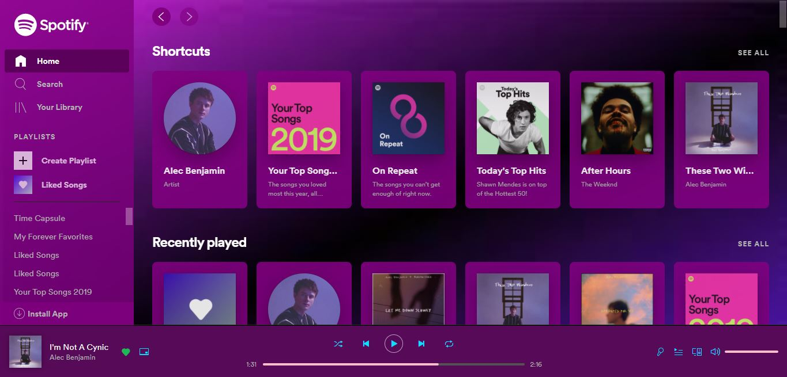

# Spotify-Purple-Theme
A purple theme for spotify web player.

# Preview

## Installation
1. Install [Stylus for Firefox](https://addons.mozilla.org/en-US/firefox/addon/styl-us/), [Chrome](https://chrome.google.com/webstore/detail/stylus/clngdbkpkpeebahjckkjfobafhncgmne), [Opera](https://addons.opera.com/en-gb/extensions/details/stylus/) or [Cascadea for Safari](https://cascadea.app/).
2. Install [spotify-purple.user.css](https://raw.githubusercontent.com/abh80/Spotify-Purple-Theme/main/spotify-purple.user.css).

# Features 
- Dynamic background changing
- Changed default green to blue and pink
- Complete purple textures
